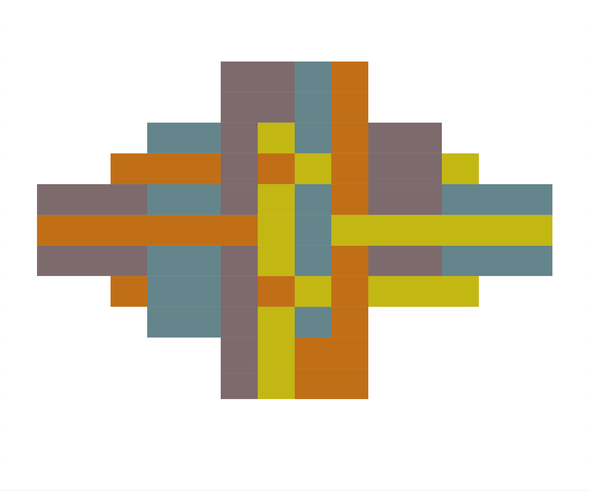

<!-- README.md is generated from README.Rmd. Please edit that file -->

# viz-recreation

## Jesse’s disliked-colours composition

From [a
tweet](https://twitter.com/kierisi/status/1412925861255421953?s=20) by
Jesse Mostipak ([@kierisi](https://twitter.com/kierisi/)):

> the assignment was to choose four colors we dislike – two intense and
> two neutral – and then paint a composition in which the colors are all
> touching one another.

I recreated it quickly using the method from [my ‘pixel art’
approach](https://www.rostrum.blog/2021/06/28/pixel-art/) using base R.

My recreation:

