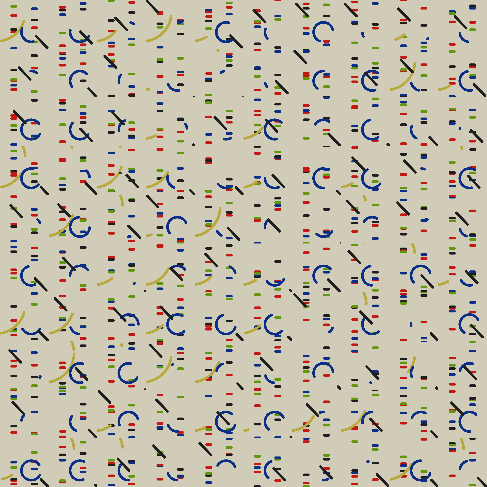

<!-- README.md is generated from README.Rmd. Please edit that file -->

```{r, include = FALSE}
knitr::opts_chunk$set(
  collapse = TRUE,
  comment = "#>"
)
```

# viz-recreation

Code to recreate or remix visualisations. The code for each one is in its own subfolder of this repo.

## Gallery

### #CottonViz

[](https://www.rostrum.blog/2021/06/08/recreate-spear/)

A [Royal Statistical Society (RSS) challenge](https://rss.org.uk/news-publication/news-publications/2021/section-group-reports/mary-eleanor-spear-dataviz-competition-for-childre/) to recreate Mary Eleanor Spear's visualisation of US cotton stocks in the 1940s. My attempt was made with base R functions only and [won the 'best recreation' category](https://twitter.com/HistoryofStats/status/1407654686593802242?s=20).

My attempt:

<div class="figure">

</div>

A step-by-step gif of its construction:

<div class="figure">

</div>

### #RecreationThursday: Hlito

[](https://www.rostrum.blog/2021/06/21/recreate-hlito/)

Week 1 (2021-06-03) of [#RecreationThursday](https://twitter.com/search?q=%23RecreationThursday&src=typed_query), curated by Natalie O'Shea: [Alfredo Hlito's _Curves and Straight_ series (1948)](https://www.moma.org/collection/works/205953). My attempt used base R functions only.

My attempt:

<div class="figure">

</div>

I randomly adjusted the element geometry 100 times:

<div class="figure">

</div>

And here's a gif of 10 of these randomised images:

<div class="figure">

</div>